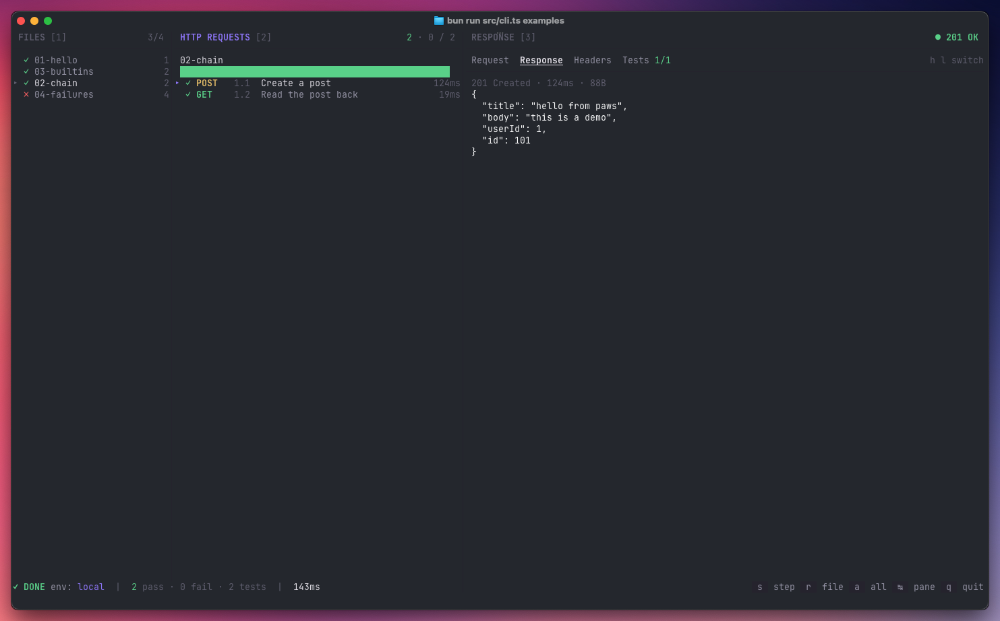

# pawsh

> A terminal-native HTTP flow runner. Run and explore Rider/IntelliJ `.http`
> files from the command line, with an interactive three-pane TUI or
> straight-line output for CI.



`pawsh` is to the terminal what the JetBrains HTTP Client is to Rider. Point it
at a `.http` file (or a directory full of them) and it'll run the requests,
execute the JavaScript pre- and post-scripts, evaluate
`client.test`/`client.assert` assertions, and chain values between steps via
`client.global.set`.

## Why

- **Runs where Rider can't** — CI, remote SSH, containers, Linux boxes.
- **Same files as Rider** — no separate format to maintain.
- **Fast feedback** — an interactive TUI for day-to-day exploration, a pretty
  console reporter for scripts and pipelines.

## Install

```sh
git clone <this-repo> pawsh
cd pawsh
bun install
bun link              # exposes `pawsh` on your $PATH via the bin entry
```

Or run it without installing:

```sh
bun /path/to/pawsh/src/cli.ts run <file-or-dir>
```

Requires [Bun](https://bun.com) 1.3+.

## Quick start

Try the bundled examples (they hit public APIs — no local server needed):

```sh
pawsh                         # launcher
pawsh run examples            # interactive three-pane view
pawsh run examples/01-hello.http
pawsh run examples/01-hello.http --only 1.1   # single step, non-interactive
```

## Usage

```
pawsh                         browse files interactively (launcher)
pawsh run <file.http>         run a single .http flow
pawsh run <dir>               run every .http in a directory, recursively
pawsh run <file> --only 1.3   run one step from a file
pawsh env list                list environments in the nearest env.json

  -e, --env <name>     environment (default: local)
  -f, --fail-fast      stop on the first failed step
      --only <step>    run only the step with this num (e.g. 1.2)
```

`pawsh` auto-picks a mode: if your terminal is a TTY you get the Ink-based
three-pane TUI; if stdout is piped or `CI=1`, you get a coloured console report
and a non-zero exit code on failure.

## Interactive keys

### Navigation

| key         | action                                    |
| ----------- | ----------------------------------------- |
| `←` / `→`   | cycle panes (Files → Requests → Response) |
| `Tab`       | next pane                                 |
| `1` `2` `3` | jump to Files / Requests / Response       |
| `↑` / `↓`   | move within the active pane               |
| `,` / `.`   | cycle through files (works in any pane)   |
| `h` / `l`   | switch tab in the Response pane           |

### Running

| key | action                            |
| --- | --------------------------------- |
| `s` | run the selected step (only)      |
| `r` | run every step in the active file |
| `a` | run every step in every file      |

### Other

| key   | action |
| ----- | ------ |
| `q`   | quit   |
| `esc` | quit   |

## Environments

`pawsh` reads the same environment files as Rider, discovered by walking up from
the `.http` file:

- `http-client.env.json` — checked into the repo, one object per environment.
- `http-client.private.env.json` — gitignored, merged on top for local secrets.

```jsonc
{
  "local": {
    "baseurl": "http://localhost:8080",
    "Security": {
      "Auth": {
        "admin_auth": { "Type": "Mock", "Token": "{{admin_token}}" }
      }
    }
  },
  "dev": {
    "baseurl": "https://api.example.dev",
    "Security": {
      "Auth": { "admin_auth": { "Type": "OAuth2" } }
    }
  }
}
```

OAuth2 entries in v1 look for a pre-fetched bearer token under
`Security.Auth.<name>.Token` in the private env file — `pawsh` won't run the
OAuth2 flow for you.

## Supported HTTP file syntax

- `### 1.1 Title` separators (numeric labels optional)
- All methods: `GET / POST / PUT / PATCH / DELETE / HEAD / OPTIONS`
- Short-form GET: a bare URL on a line after `###`
- Optional trailing `HTTP/1.1` on the request line
- Indented URL continuation lines
- Headers: `Key: Value`
- Bodies: inline JSON / text, or `< ./path/to/file` for a file upload
- `< ` pre-request script
- `> ` response handler (`client.test`, `client.assert`, etc.)
- Built-in vars: `{{$timestamp}}` `{{$uuid}}` `{{$random.integer(a, b)}}`
  `{{$auth.token("name")}}`
- Environment files (`http-client.env.json` + private overrides)
- `#` and `//` comments

**Not yet supported:** `import … from "utilities"`, OAuth2 flows, JSONPath body
expansion (`{{$.items..name}}`).

## Example `.http` file

```http
### 1.1 Create a post
POST {{baseurl}}/posts
Content-Type: application/json

{
  "title": "hello",
  "userId": 1
}

> 

### 1.2 Read it back
GET {{baseurl}}/posts/{{post_id}}
```

## License

MIT — see [LICENSE](LICENSE).
